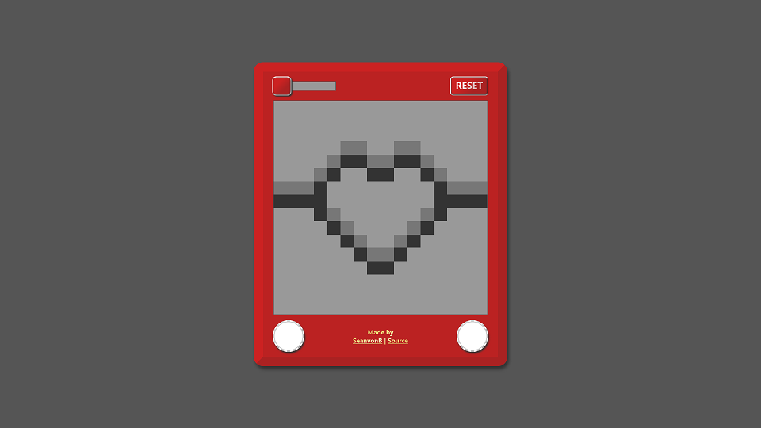

# Etch-A-Sketch

[LIVE PREVIEW](https://seanvonb.github.io/etch-a-sketch/)

This web recreation of the classic [Etch-A-Sketch](https://en.wikipedia.org/wiki/Etch_A_Sketch) toy helped reinforce my understanding of DOM manipulation, dynamic styling, and responsive design. It should display and function equally well on desktop and mobile – please bully me about this if it doesn't.

## Features

-   You can draw by moving your cursor or finger across the canvas.
-   You can clear the canvas with the reset button.
-   You can adjust the canvas density with the size slider.
-   Touch events don't have an equivalent to `mouseover` or `hover` cursor events, so `touchDraw()` uses coords from `Event.touches` to locate elements and allow continuous drawing on mobile.

## Credits

-   This project was recommended by [The Odin Project](https://www.theodinproject.com/).
-   "Etch-A-Sketch" is owned by Spin Master of Ontario, Canada.

## License

Copyright © 2021 Sean von Bayern  
[MIT License](LICENSE.md) – "My code? **Our** code!"
